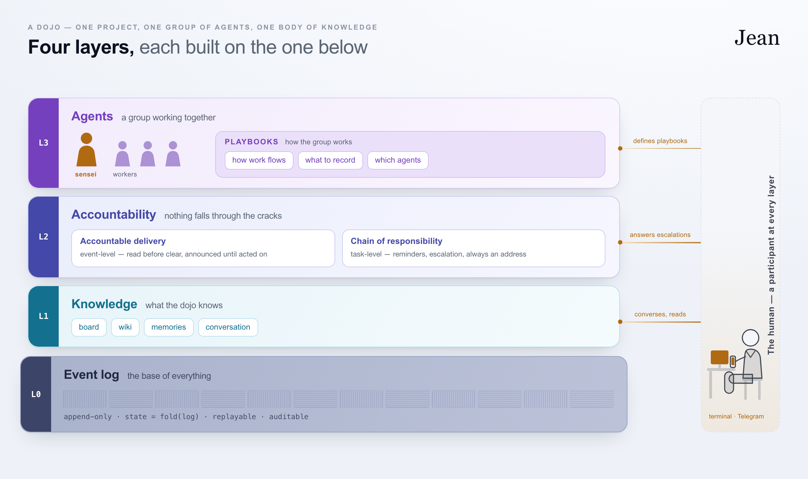

# Jean

 

Jean /ʒɑ̃/ (zhon) runs a group of Claude Code agents on one project, with one of them in charge.

A **dojo** is where a group trains under one teacher; here it is a project, the agents working on it, and the record of everything that passed between them. The **sensei** is the agent in charge: you talk to it, and it turns what you ask for into tasks and hands them out. A **worker** is an agent that takes a task, does it, and reports back.

You tell the sensei what you want. It writes a task, picks a worker, and sends it over. The worker does the work and reports back to the sensei, which has the result when you ask — and if the worker goes quiet, the sensei hears about that too. Every task, message and report passes through the dojo's log as it happens, so when you come back you read what happened, in order. What the agents learn while they work — about the project, and about how you work — accumulates in the dojo's **library**: a wiki built from what they memorize, which every agent reads, so the dojo grows more tuned to your work the longer it runs.

Everything runs on your machine: the agents, the log, and the server they share. One person, one project, a handful of agents. Claude Code is the reference runtime, not a limit of the design. The dojo — its log, board, mailbox and the protocol agents speak — is tied to no provider; Codex and OpenCode are planned next.

New to Jean? Start with [your first session](docs/running.md#your-first-session).

<picture>
  <source media="(prefers-color-scheme: dark)" srcset="docs/diagrams/layers-dark.png">
  
</picture>

Four layers, each resting on the one below, make up the stack: an **event log** that keeps everything that happened, **knowledge** the dojo searches, **accountability** for who owes the next move, and **agents** who act on it. You take part at every layer.

## Compared to the alternatives

**A single Claude Code session** is simpler, and needs nothing extra to run. It can spawn subagents and background tasks, but they report into that one conversation, in one terminal. A dojo's agents are separate, long-running sessions, each with its own mailbox and its own working directory, passing work between them through a sensei that keeps the record — with a durable log anyone with access can read back. That log survives whether or not the session that produced it is still open.

**A hosted agent service** runs the work somewhere else and hands back the result, and keeps going while your machine is shut. A dojo's agents are ordinary Claude Code sessions in your own terminals, and that is the trade: they are up while your machine is, and in exchange the orchestration is something you can step into. Dispatch through the sensei and watch the board, or open a worker's own terminal and work with it directly — per agent, and changing your mind mid-task.

**An agent SDK or framework** gives you the pieces to build an agent that behaves as you specify. Jean builds no agent: each one is Claude Code, the tool you already work in, with a task board, a mailbox and an event log wired around it.

A dojo is deliberately unopinionated about the work itself. What it gives you is a task board, a searchable record of what the dojo has learned, delivery guarantees on every message, and a bridge to Telegram or Slack for when you are away from the terminal. Who the agents are, how the work divides between them, and how much of it you orchestrate rather than do yourself are yours to set, and to change as you go.

The cost, in every case: a dojo's own infrastructure — one background process, idle between events — running alongside your agents.

## Docs

- [Running Jean](docs/running.md) — install, and your first session
- [Agents](docs/agents.md) — roles and sessions
- [Messaging](docs/messaging.md) — mailboxes, delivery, replying, commenting
- [CLI reference](docs/cli-reference.md)
